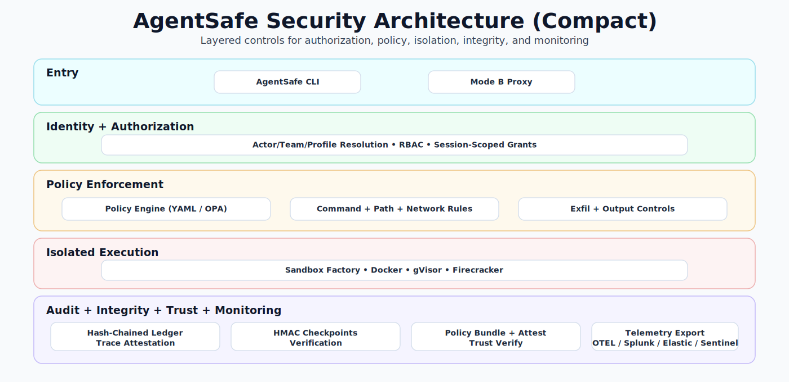

# AgentSafe: Zero-Trust Sandbox for Local AI Agents

AgentSafe is an open-source safety harness you put in front of local agent tool calls. It applies policy, executes commands in a restricted Docker sandbox, controls network egress, and records an audit trail that explains every allow/block decision.

## What problem does this solve?
Local coding or automation agents can execute shell commands and fetch data with broad host access. A single prompt injection or bad tool decision can read secrets (`~/.ssh`), modify sensitive files, or exfiltrate data over the network. AgentSafe constrains that blast radius.

## Why OpenClaw-style agents are scary
OpenClaw-style agents can chain tool calls fast and autonomously. Without guardrails they can:
- Read host credentials and config files.
- Execute risky package/system commands.
- Exfiltrate data to arbitrary domains.
- Hide intent unless you maintain robust logs.

AgentSafe enforces default-deny policy plus auditable decisions.

## Security architecture (layered view)


- Defense in depth: identity, policy, execution isolation, and integrity are separate control planes.
- Explicit authorization: RBAC and session-scoped grants gate privileged actions.
- Exfiltration-aware enforcement: request/response controls reduce common data-leak paths.
- Verifiable operations: hash-chained audit events, trace attestations, and checkpoint verification.
- Enterprise-ready visibility: telemetry export supports OTEL, Splunk, Elastic, and Sentinel.

## MVP features
- Default-deny policy engine (YAML)
- Command allow-list with optional argument regex
- Workspace-only path controls + explicit deny roots (`/etc`, `/proc`, `/sys`, `$HOME`)
- Env var allow-list (no ambient secrets)
- Network modes:
  - `none` (default)
  - domain allow-list (`allow_proxy`) with HTTP CONNECT proxy
- Simple per-tool token-bucket rate limiting
- Hash-chained JSONL audit ledger + markdown audit report
- Optional syscall-level file trace for `run` via `--trace-files` (best effort)
  - Trace artifact digest is recorded in audit events (`sandbox.trace_digest`) and covered by ledger hash chaining.
- OpenClaw Docker/WSL demo integration (with deterministic mock flow)
- Mode B gateway proxy enforcement point for tool-execution APIs (configurable regex path matching)
- Session-scoped CLI grants with TTL (`agentsafe grant ...`)
- Local-first telemetry export command (`agentsafe telemetry export --mode otel --endpoint ...`)
- SIEM export modes for Splunk, Elastic, and Sentinel
- Local audit dashboard HTML renderer (`agentsafe audit dashboard`)
- Local approval dashboard server (`agentsafe serve --dashboard`)
- Pluggable sandbox profiles (`docker`, `gvisor`, `firecracker` runtime adapters)
- Outbound `http.fetch` request guards (method/path/header/body checks + deny patterns)
- Signed policy bundle format with ed25519 verification support
- Trust-policy verification for bundle issuer/source/age/chain (`agentsafe policy verify-trust`)

## WSL2 prerequisites
- Windows with WSL2 Ubuntu
- Docker Desktop or Docker Engine integrated with WSL
- `docker compose` available in WSL shell
- Python 3.11+
- GNU Make

## macOS quickstart and caveats
- Works well on macOS for the default runtime path (`docker` sandbox profile).
- Prerequisites:
  - Docker Desktop for Mac
  - Python 3.11+
  - GNU Make (`brew install make` if needed)
- Quickstart:
```bash
git clone <this-repo>
cd agent-safe
make setup
make demo-openclaw
make demo-modeb-gateway
```
- Runtime profile caveats on macOS:
  - `docker`: supported and recommended.
  - `gvisor`: generally Linux-focused; availability may vary on macOS Docker setups.
  - `firecracker`: requires Linux/KVM and is not a native macOS execution path.
- Networking note:
  - The default proxy path uses `host.docker.internal`, which is supported on Docker Desktop for Mac.

## Quickstart (5-10 minutes)
```bash
git clone <this-repo>
cd agent-safe
make setup
make demo-openclaw
make demo-modeb-gateway
```

Expected behavior:
- BLOCK read attempt on `/etc/passwd`
- BLOCK egress attempt to `https://example.com`
- ALLOW safe commands (`ls`, `git status`)
- Approval-required flow for `curl` (block, then allow after token)
- Audit events in `audit/ledger.jsonl`
- Shareable report at `audit/report.md`

## How policy works (short)
Policies live in `policies/*.yaml`.
- `default_decision: deny`
- `tools.commands`: allowed binaries and optional arg regex
- `tools.paths`: allow + deny path roots
- `tools.env_allowlist`: which env vars are passed to sandbox
- `tools.network`: `none` or `allow_proxy` + allowed domains/ports
- `tools.network` outbound controls: `http_methods`, `http_path_allow_regex`, `max_request_body_bytes`, `deny_header_patterns`, `deny_body_patterns`
- `tools.output` covert-channel controls: `max_stdout_bytes`, `max_stderr_bytes`, `proxy_max_response_bytes`, `proxy_min_delay_ms`, `proxy_jitter_ms`
- `tools.rate_limits`: token bucket by category (`run`, `fetch`)

CLI usage:
```bash
agentsafe run --policy policies/demo-openclaw.yaml --actor openclaw-agent --workspace . -- ls
agentsafe run --policy policies/demo-openclaw.yaml --actor openclaw-agent --workspace . --trace-files -- ls
agentsafe fetch --policy policies/demo-openclaw.yaml --actor openclaw-agent --workspace . https://github.com --output demos/github.html
agentsafe audit tail
agentsafe audit report --format md --output audit/report.md
agentsafe audit dashboard --output audit/dashboard.html
agentsafe audit verify-chain
agentsafe audit verify-trace
agentsafe audit verify-all
agentsafe audit checkpoint --key-file .secrets/ledger_hmac.key --note "daily checkpoint"
agentsafe audit verify-checkpoints --key-file .secrets/ledger_hmac.key --require-current
agentsafe grant issue --actor openclaw-agent --tool run --scope "curl *" --session-id "session-*" --ttl 600 --reason "demo approval"
agentsafe grant request --actor openclaw-agent --tool run --scope "curl https://openai.com" --session-id "session-123" --ttl 300 --reason "need docs"
agentsafe grant requests --status pending
agentsafe grant approve <request_id> --reviewer secops --ttl 600 --reason "approved for demo"
agentsafe grant scope-template --template run-binary --value curl
agentsafe proxy --host 0.0.0.0 --port 8090
agentsafe serve --dashboard --host 127.0.0.1 --port 8787
agentsafe policy bundle --policy policies/demo-openclaw.yaml --out policies/bundle.json
agentsafe policy attest --policy policies/demo-openclaw.yaml --issuer secops --out policies/attested_bundle.json
agentsafe policy verify --policy policies/demo-openclaw.yaml --bundle policies/bundle.json
agentsafe policy verify-chain --bundle policies/bundle.json
agentsafe policy verify-trust --policy policies/demo-openclaw.yaml --bundle policies/bundle.json --trust-policy policies/trust.example.yaml
agentsafe policy profile-resolve --profiles-path policies/profiles.example.yaml --actor alice --team secops
```

Policy profile selection is also supported in `run`/`fetch`:
```bash
agentsafe run --profiles-path policies/profiles.example.yaml --actor alice --team secops -- ls
agentsafe fetch --profiles-path policies/profiles.example.yaml --actor alice --team secops https://github.com --output demos/github.html
```
If `--policy` is provided, it takes precedence over profile selection.

## OPA backend (optional)
`yaml` remains the default backend. To use OPA/Rego decisions:
```bash
docker run --rm -p 8181:8181 \
  -v $(pwd)/policies/opa:/policies \
  openpolicyagent/opa:latest run --server --addr=0.0.0.0:8181 /policies/agentsafe.rego

export AGENTSAFE_OPA_URL=http://127.0.0.1:8181
agentsafe run --policy policies/demo-openclaw.yaml --policy-backend opa --workspace . -- ls
```

Notes:
- AgentSafe sends action + loaded YAML policy as OPA input to `agentsafe/evaluate`.
- Rego sample file: `policies/opa/agentsafe.rego`.

Live integration parity test (Dockerized OPA):
```bash
make test-opa-live
```

Run a local OPA service for development:
```bash
make opa-local-up
export AGENTSAFE_OPA_URL=http://127.0.0.1:8181
make opa-local-health
```

## Demo walkthrough
1. Filesystem exfil attempt:
- Command: `agentsafe run ... -- cat /etc/passwd`
- Result: `BLOCK path denied`

2. Network egress blocked:
- Command: `agentsafe fetch ... https://example.com`
- Result: `BLOCK domain not allowlisted`

3. Safe operations allowed:
- Commands: `agentsafe run ... -- ls`, `agentsafe run ... -- git status`
- Result: `ALLOW`

4. Approval-required command:
- Command: `agentsafe run ... -- curl https://openai.com`
- Result: `BLOCK requires approval`
- Approve through grant workflow:
  - `agentsafe grant request --actor openclaw-agent --tool run --scope "curl https://openai.com" --session-id "session-123" --ttl 300`
  - `agentsafe grant approve <request_id> --reviewer secops --ttl 600`
  - rerun command -> allowed by policy gate
- File token fallback (legacy demo): add line to `.agentsafe_approvals`.

## OpenClaw integration
See [integrations/openclaw/README.md](integrations/openclaw/README.md).

## Light Gateway contract-first Mode B
See [integrations/light_gateway/README.md](integrations/light_gateway/README.md).
This provides a strict canonical tool-execution contract at `/v1/tools/execute`
for adapter and policy/grant/audit testing independent of OpenClaw internals.

Mode A (implemented):
- OpenClaw agent tools are wrapped with `agentsafe run` and `agentsafe fetch`.

Mode B (scaffold):
- Reverse proxy/policy enforcement at gateway API boundary (see `agentsafe/agentsafe/proxy/modeb_proxy.py`).
- Canonical boundary is configurable with `AGENTSAFE_PROXY_TOOL_PATH_REGEX`.
- Optional per-user/team profile selection for proxy policy backend/path:
  - Set `AGENTSAFE_PROXY_PROFILES_PATH=policies/profiles.example.yaml`.
  - Optional headers: `AGENTSAFE_ACTOR_HEADER`, `AGENTSAFE_TEAM_HEADER`, `AGENTSAFE_PROFILE_HEADER`.
- Optional per-tool RBAC gate at proxy boundary:
  - Set `AGENTSAFE_RBAC_POLICY=policies/rbac.example.yaml`.
  - Optional team header override via `AGENTSAFE_TEAM_HEADER` (default `X-Agent-Team`).
- OpenClaw structured adapters available: `openclaw_strict_v2`, `openclaw_strict_v1`, `openclaw_strict_legacy`, `openclaw_auto`.

## SIEM export modes
```bash
# OpenTelemetry collector
agentsafe telemetry export --mode otel --endpoint http://localhost:4318/v1/logs

# Splunk HEC
agentsafe telemetry export --mode splunk --endpoint http://localhost:8088/services/collector \
  --splunk-token <token> --splunk-index agentsafe

# Elastic bulk API
agentsafe telemetry export --mode elastic --endpoint http://localhost:9200 \
  --elastic-index agentsafe-audit --elastic-api-key <api_key>

# Sentinel/custom collector
agentsafe telemetry export --mode sentinel --endpoint http://localhost:8080/ingest \
  --sentinel-shared-key <shared_key> --sentinel-log-type AgentSafeAudit
```

## Sandbox profile adapters
```bash
agentsafe run --policy policies/demo-openclaw.yaml --sandbox-profile docker --workspace . -- ls
agentsafe run --policy policies/demo-openclaw.yaml --sandbox-profile gvisor --workspace . -- ls
agentsafe run --policy policies/demo-openclaw.yaml --sandbox-profile firecracker --workspace . -- ls
```
Notes:
- `gvisor` expects a Docker runtime plugin like `runsc`.
- `firecracker` profile uses a real Firecracker microVM adapter (`agentsafe/agentsafe/sandbox/firecracker_runner.py`).
- Set guest artifacts:
  - `AGENTSAFE_FIRECRACKER_KERNEL=/path/to/vmlinux`
  - `AGENTSAFE_FIRECRACKER_ROOTFS=/path/to/rootfs.ext4`
- Integration notes: `integrations/firecracker/README.md`.

## Threat model and non-goals
See [docs/THREAT_MODEL.md](docs/THREAT_MODEL.md).

## MVP limitations
- Command/file observation in `run` is best-effort from arguments, not full syscall tracing.
- `--trace-files` improves visibility with `strace` but remains best-effort and Linux container runtime dependent.
- `agentsafe fetch` runs inside the Docker sandbox using `curl`, but file-touch visibility is still output-path based (not syscall traced).
- Domain allow-list can still leak data to allowed domains.
- Docker sandbox is strong but not equivalent to microVM isolation.
